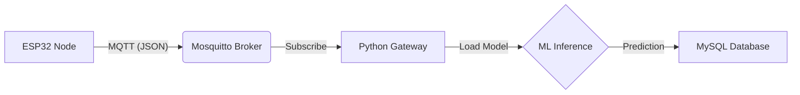

ML and DataPipeline
###############################################################################################################################################################
# 🌲 IoT Intelligent Fire Detection System

An advanced IoT solution for early fire detection in forest or building environments. This system utilizes **Edge Computing** for data acquisition and a **Local Python Gateway** with **Machine Learning (Random Forest)** to filter noise, calibrate sensors, and predict fire risks with high accuracy before logging data to a MySQL database.

## 🚀 Features

  * **Multi-Sensor Data Acquisition:** Real-time monitoring of Temperature, Humidity, and Smoke/Gas levels using ESP32.
  * **Intelligent Processing:** Uses a **Random Forest Classifier** to distinguish between actual fires and false alarms (e.g., hot days or sensor noise).
  * **Auto-Calibration:** Software-based calibration mapping raw sensor values (ADC) to standardized datasets.
  * **Robust Communication:** MQTT protocol (Mosquitto) for reliable low-latency data transmission.
  * **Centralized Logging:** Stores historical data, risk percentages, and status alerts in a MySQL database.

-----

## 🛠️ Architecture

The system follows a **Pub/Sub** architecture with an intelligent middleware layer.



1.  **Edge Layer:** ESP32 reads raw analog/digital data.
2.  **Transport Layer:** Data is serialized to JSON and sent via MQTT.
3.  **Processing Layer:** Python script loads a pre-trained `.pkl` model, normalizes the data, and predicts fire probability.
4.  **Storage Layer:** Final structured data is saved for the web dashboard.

-----

## 📦 Hardware Requirements

  * **Microcontroller:** ESP32 Dev Kit V1
  * **Gas Sensor:** MQ-2 or MQ-135 (Smoke/LPG/CO)
  * **Temp/Hum Sensor:** DHT11 or DHT22
  * **Flame Sensor:** IR Flame Sensor (Optional)
  * **Connectivity:** Wi-Fi (2.4GHz)

-----

## 💻 Software Prerequisites

  * **VS Code** with **PlatformIO** Extension (for ESP32).
  * **Python 3.9+** (for the Gateway).
  * **Mosquitto MQTT Broker** (running locally or on a server).
  * **XAMPP / MySQL** (for the database).

-----

## ⚙️ Installation & Setup

### 1\. Database Setup

Run the following SQL command in your MySQL interface (phpMyAdmin) to create the required table:

```sql
CREATE DATABASE iot_project;
USE iot_project;

CREATE TABLE sensor_logs (
    id INT AUTO_INCREMENT PRIMARY KEY,
    node_id VARCHAR(50),
    temp_val FLOAT,
    humidity_val FLOAT,
    smoke_level FLOAT,
    fire_risk FLOAT,
    alert_status VARCHAR(20),
    created_at TIMESTAMP DEFAULT CURRENT_TIMESTAMP
);
```

### 2\. Python Environment (The Brain)

Navigate to the `Server_Side` folder and install dependencies:

```bash
pip install pandas scikit-learn joblib paho-mqtt mysql-connector-python
```

**Training the Model:**
Before running the gateway, you must generate the AI model file.

```bash
python train_model.py
```

*Output: `fire_model.pkl` will be created.*

### 3\. ESP32 Firmware

1.  Open the `ESP32_Firmware` folder in **PlatformIO**.
2.  Edit `src/main.cpp`:
      * Update `ssid` and `password` with your Wi-Fi credentials.
      * Update `mqtt_server` with your computer's IP address.
3.  Upload the code to your board.

-----

## 🏃‍♂️ Usage

1.  **Start Services:** Ensure Mosquitto and MySQL (XAMPP) are running.
2.  **Start the Gateway:**
    ```bash
    python gateway.py
    ```
    *You should see: `✅ Model loaded successfully!` and `📡 Listening...`*
3.  **Power the ESP32:**
      * The ESP32 will connect to Wi-Fi and start publishing JSON packets.
      * The Python terminal will display real-time predictions:
        ```text
        [14:05:01] Node: node_01
        Data -> Gas: 2400 (Calib: 580) | Temp: 45°C
        🔥 STATUS: FIRE DETECTED! (Confidence: 92.5%)
        💾 Data saved to Database
        ```

-----

## 📂 Project Structure

```text
IoT-Fire-Detection/
├── 📂 ESP32_Firmware/       # Embedded C++ Code
│   ├── platformio.ini       # Library dependencies
│   └── src/
│       └── main.cpp         # Sensor logic & MQTT
│
└── 📂 Server_Side/          # Python & ML Logic
    ├── fire_data.csv        # Dataset for training
    ├── train_model.py       # Script to create the AI model
    ├── fire_model.pkl       # Compiled Random Forest Model
    └── gateway.py           # Main Orchestrator (MQTT + ML + DB)
```

-----
## 📄 License

This project is open-source. Feel free to use and modify.
